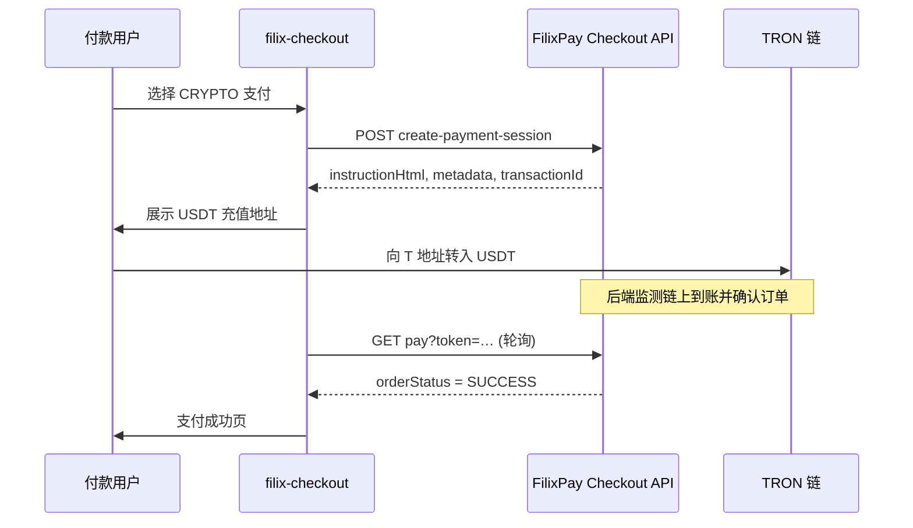

# CRYPTO 通道集成指南

> **适用范围：** 在 `filix-checkout` 中对接 FilixPay 自托管 TRON-USDT（CRYPTO）支付。  
> **前提：** FilixPay 后端已开通 CRYPTO 渠道；本仓库仅调用 Checkout API，不直连区块链 Gateway。

**用户流程：** 选择 CRYPTO → 展示 USDT 充值地址 → 链上到账后自动确认（无需 TronLink、无需上传转账凭证）。

---

## 1. 端到端流程



**与第三方加密货币收银台的区别：** 充值地址由 FilixPay 派生，到账后**自动确认**，不需要人工审核凭证。

---

## 2. 前置条件

| 项 | 说明 |
|----|------|
| FilixPay 后端 | 已部署并启用 CRYPTO 支付渠道 |
| 商户配置 | 商户已绑定 **CRYPTO** 渠道及对应 `configId` |
| filix-checkout | 已配置 `BACKEND_API_URL` 等环境变量（见根目录 `.env.example`） |

Checkout **不直接调用** 区块链 Gateway；所有请求经 BFF 转发至 FilixPay Checkout API。

---

## 3. API 契约

### 3.1 加载收银台

```
GET /api/checkout/pay?token={token}
```

响应 `data.availablePaymentMethods` 中包含 `channelCode: "CRYPTO"`（商户已开通时）。

### 3.2 发起支付

```
POST /api/checkout/create-payment-session
Content-Type: application/json

{
  "token": "...",
  "preferredPaymentMethod": "CRYPTO",
  "configId": "<商户 CRYPTO 配置 ID>"
}
```

**成功响应示例：**

```json
{
  "code": "SUCCESS",
  "data": {
    "instructionHtml": "<div>...USDT (TRC20) 充值...</div>",
    "transactionId": "PA-xxx-channel-order-id",
    "metadata": {
      "depositAddress": "T...",
      "chain": "TRON",
      "asset": "USDT",
      "watchId": "watch-...",
      "expireAt": "2026-06-26T12:00:00Z"
    }
  }
}
```

| 字段 | CRYPTO | RECEIPT（银行转账） |
|------|--------|---------------------|
| `instructionHtml` | 有 | 有 |
| `receiptUploadUrl` | **无** | 有 |
| `qrCodeUrl` | 无 | 部分渠道有 |
| `metadata.depositAddress` | 有 | 无 |

**常见错误码：**

| 场景 | code |
|------|------|
| Watch 容量满 | `WATCH_CAPACITY_EXCEEDED` |
| Gateway 不可用 | `GATEWAY_ERROR` |
| 参数缺失 | `VALIDATION_ERROR` |

---

## 4. 前端实现说明

本仓库已实现 CRYPTO 通道，主要涉及以下文件：

| 文件 | 职责 |
|------|------|
| `src/components/checkout/CheckoutClient.tsx` | 发起支付、CRYPTO 分支、状态轮询 |
| `src/components/checkout/CryptoDepositModal.tsx` | 展示充值地址与说明（无凭证上传） |
| `src/types/checkout.ts` | 含 `metadata` 等响应类型 |
| `public/icons/crypto.svg` | CRYPTO 渠道图标 |
| `src/app/api/checkout/*` | BFF 透传，无需 CRYPTO 专用路由 |

**关键逻辑：**

1. CRYPTO 响应**没有** `receiptUploadUrl`，走 `CryptoDepositModal` 而非 `ReceiptModal`。
2. 展示充值地址后**立即启动轮询**（约每 3s 调用 `GET /api/checkout/pay?token=...`）。
3. `orderStatus === 'SUCCESS'` 时刷新页面展示成功态。
4. 用户关闭弹窗时停止轮询并刷新收银台元数据。

### 与 RECEIPT 通道对照

| | RECEIPT | CRYPTO |
|---|---------|--------|
| UI 组件 | `ReceiptModal` + 上传 | `CryptoDepositModal`，无上传 |
| 到账确认 | 人工审核凭证 | 链上自动确认 |
| 轮询 | 上传后刷新 | 展示地址后即轮询 |
| 用户操作 | 转账 + 上传截图 | 仅链上转账 |

---

## 5. instructionHtml 与 metadata

后端可在 `instructionHtml` 中返回 HTML 片段（网络、金额、T 开头地址、有效期等），前端直接渲染。

也可改用 `metadata.depositAddress` 等字段自建 UI。当前实现两者均支持：优先展示 `instructionHtml`，并可选提供地址复制等功能。

---

## 6. 测试清单

### 6.1 联调步骤

1. 商户开通 CRYPTO 渠道
2. 创建订单，打开 checkout `?token=...`
3. 确认支付方式列表出现 CRYPTO
4. 点击 CRYPTO → 弹窗显示 **T 开头地址**、金额、有效期
5. Network：`create-payment-session` 返回 `instructionHtml`，**无** `receiptUploadUrl`
6. 向地址转入 **≥ 订单金额** 的 TRC20-USDT
7. 等待轮询：`orderStatus` 变为 `SUCCESS`

### 6.2 常见失败

| 现象 | 可能原因 |
|------|----------|
| 列表无 CRYPTO | 商户未配置该渠道 |
| 已转账但一直 PENDING | 金额不足、转错链/代币、Watch 过期 |
| 图标不显示 | 缺少 `public/icons/crypto.svg` |

### 6.3 完整 E2E 路径

必须走完整收银台流程：

**创建订单 → checkout token → 选 CRYPTO → create-payment-session**

不要跳过 Checkout API 直接调用底层 Gateway 接口，否则无法创建 `payment_attempt`，订单无法入账。

---

## 7. 当前不支持

| 功能 | 说明 |
|------|------|
| TronLink「连接钱包」 | 用户可在钱包 App / 交易所手动转账 |
| 凭证上传 | 仅 RECEIPT 渠道 |
| 直接调 Gateway prepare | 须经 Checkout 创建 payment attempt |

---

## 相关文档

- [风控续跑集成指南](./risk-resume-integration.md)
- [文档索引](./README.md)
