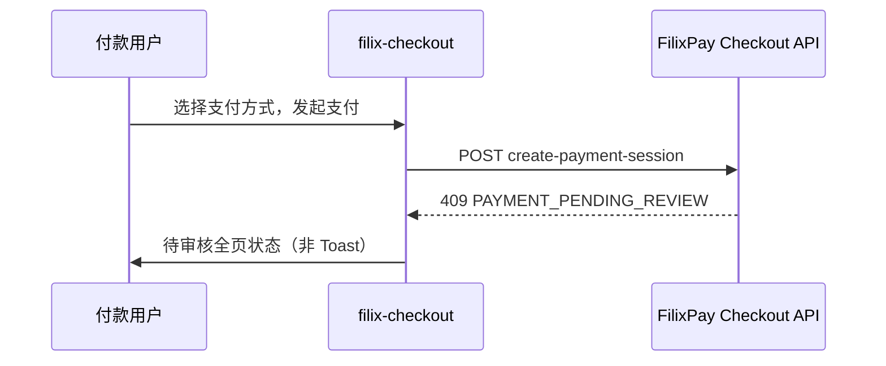
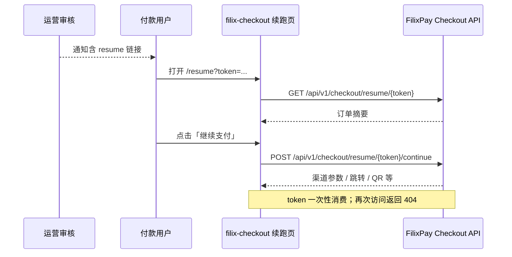

# 风控续跑集成指南

> **适用范围：** 在 `filix-checkout` 中对接 FilixPay PRE_AUTH 风控：`RISK_BLOCKED`、`PAYMENT_PENDING_REVIEW`，以及审核通过后的 **USER_RESUME** 续跑。  
> **前提：** FilixPay 后端已启用风控模块；本仓库仅调用 Checkout API。

---

## 1. 行为概览

在 `create-payment-session` 前，FilixPay 会执行 PRE_AUTH 风控评估。收银台需处理：

| 结果 | HTTP | code | 用户可见行为 |
|------|------|------|--------------|
| 拦截 | 403 | `RISK_BLOCKED` | 全页提示「支付已被风控拦截」 |
| 待审核 | 409 | `PAYMENT_PENDING_REVIEW` | 全页提示「支付待人工审核，请等待通知」 |
| 审核通过续跑 | — | — | 续跑页展示订单摘要 → 用户点击「继续支付」 |

续跑必须由用户主动触发（不支持审核后自动调渠道）。

---

## 2. 端到端流程

### 2.1 支付被审核拦截



### 2.2 审核通过后 USER_RESUME



---

## 3. 前置条件

| 项 | 说明 |
|----|------|
| FilixPay 后端 | 已部署 PRE_AUTH 风控与 USER_RESUME |
| filix-checkout | Next.js，开发端口 **3001** |
| BFF | `src/app/api/checkout/*` 代理 Checkout API |
| 环境变量 | `BACKEND_API_URL` / `FILIXPAY_*_URL`（见 `.env.example`） |

Checkout **不直接**调用 Admin 或商户 Portal API。

---

## 4. API 契约

### 4.1 create-payment-session — 风控错误码

**POST** `/api/checkout/create-payment-session`  
→ 后端 `POST /api/v1/checkout/create-payment-session`

```json
{
  "success": false,
  "code": "RISK_BLOCKED",
  "message": "Payment blocked by risk policy"
}
```

```json
{
  "success": false,
  "code": "PAYMENT_PENDING_REVIEW",
  "message": "Payment pending risk review"
}
```

前端在 `src/lib/payment-handoff.ts` 与 `CheckoutClient.tsx` 中将上述 code 映射为全页 `StatusView`，**不会**仅用 Toast 一闪而过。

### 4.2 Peek Resume（只读校验）

**GET** `/api/checkout/resume/[token]`  
→ 后端 `GET /api/v1/checkout/resume/{token}`

成功 `data` 字段：

| 字段 | 类型 | 说明 |
|------|------|------|
| `paymentAttemptId` | number | payment attempt ID |
| `tradeStatus` | string | 期望 `READY_FOR_AUTH` |
| `amount` | number | 金额 |
| `resumeExpireAt` | string | ISO-8601 过期时间 |
| `tradeNo` | string | 订单号 |
| `subject` | string | 商品标题 |
| `currency` | string | 如 CNY |
| `merchantName` | string | 商户名 |
| `channelCode` | string | 已选渠道 |

失败：`404` + `code: RESUME_TOKEN_INVALID`

### 4.3 Continue Resume（消费 token）

**POST** `/api/checkout/resume/[token]/continue`  
→ 后端 `POST /api/v1/checkout/resume/{token}/continue`

Body 可为空 `{}`（后端从 attempt 恢复渠道）。

成功：响应结构与 `create-payment-session` 相同（`paymentUrl` / `html` / `qrCodeUrl` / `instructionHtml` 等）。

失败码：

| code | HTTP | 说明 |
|------|------|------|
| `RESUME_TOKEN_INVALID` | 404 | 无效、过期或已消费 |
| `RISK_BLOCKED` | 403 | 续跑时仍被拦截 |
| `PAYMENT_PENDING_REVIEW` | 409 | 状态异常 |
| `PAYMENT_FAILED` | 500 | 渠道失败 |

续跑成功后复用 `payment-handoff.ts` 中的渠道响应处理（跳转、QR、CRYPTO 弹窗、轮询等）。

---

## 5. 路由与续跑链接

| 用户 URL | 实现 |
|----------|------|
| `/resume?token={plainToken}` | `src/app/resume/page.tsx` + `ResumeClient.tsx` |

**注意：** resume token 来自审核通知，与主收银台的 payment `?token=` **不是**同一类凭证。

FilixPay 后端配置的续跑链接格式：

```
{checkout-base-url}/resume?token={plainToken}
```

示例：

```
https://your-checkout-host/resume?token=abc123...
```

BFF 路由：

- `GET/POST /api/checkout/resume/[token]/*` → 转发至 FilixPay Checkout API

---

## 6. UI 状态

| 状态 | 场景 | 组件 |
|------|------|------|
| `blocked` | `RISK_BLOCKED` | `StatusView` |
| `pending_review` | `PAYMENT_PENDING_REVIEW` | `StatusView` |
| `error` | `RESUME_TOKEN_INVALID` | `ResumeClient` |
| `success` | 支付成功 | 现有成功页 |

对 BLOCK / PENDING_REVIEW **禁止**仅 Toast 提示——用户会误以为可重试并重复创建 attempt。

---

## 7. 主要源码

| 文件 | 职责 |
|------|------|
| `src/app/resume/page.tsx` | 续跑页入口 |
| `src/components/checkout/ResumeClient.tsx` | 摘要展示、继续支付 |
| `src/app/api/checkout/resume/[token]/route.ts` | Peek BFF |
| `src/app/api/checkout/resume/[token]/continue/route.ts` | Continue BFF |
| `src/lib/payment-handoff.ts` | 风控错误码映射、渠道响应处理 |
| `src/components/checkout/StatusView.tsx` | blocked / pending_review 全页态 |
| `src/components/checkout/CheckoutClient.tsx` | 主收银台风控分支 |

BFF 实现遵循与 `pay/route.ts` 相同的模式：转发请求、透传 JSON 与 HTTP 状态码。

---

## 8. 联调与验收

### 8.1 建议测试步骤

1. 触发 `REVIEW_BEFORE_AUTH` → 收银台 409 → 待审核页
2. 运营审核通过（USER 续跑模式）→ 用户收到 resume 链接
3. 打开 `/resume?token=...` → 摘要正确
4. 点击继续 → 渠道调用成功
5. 再次打开同一链接 → `RESUME_TOKEN_INVALID`
6. 触发 BLOCK 规则 → 403 → 拦截页

### 8.2 本地开发

```bash
npm run dev
# http://localhost:3001/?token=<payment_token>
# http://localhost:3001/resume?token=<resume_token>
```

### 8.3 构建自检

```bash
npm run build
```

---

## 9. 范围说明

以下能力由 FilixPay 平台其他组件提供，**不在本仓库范围内**：

- PRE_AUTH 规则配置与运营审核工作台
- 商户 Portal 风控规则管理
- 审核后自动续跑（SYSTEM_RESUME）

集成方只需确保 FilixPay 后端已正确配置，并按本文档对接 Checkout API 即可。

---

## 相关文档

- [CRYPTO 通道集成指南](./crypto-integration.md)
- [文档索引](./README.md)
